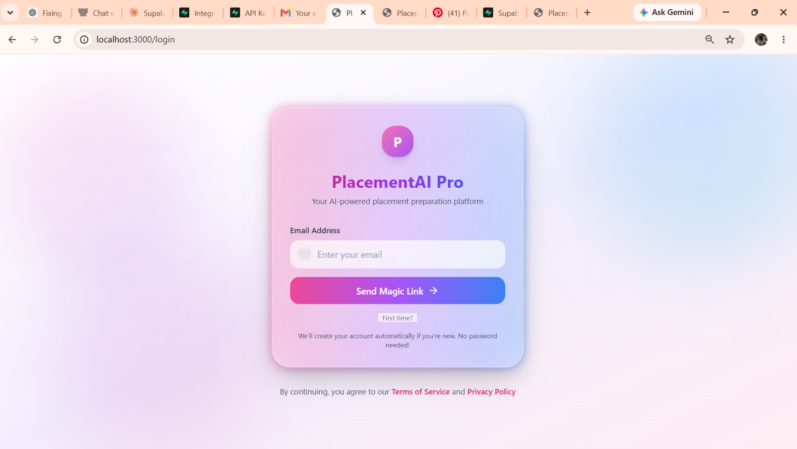
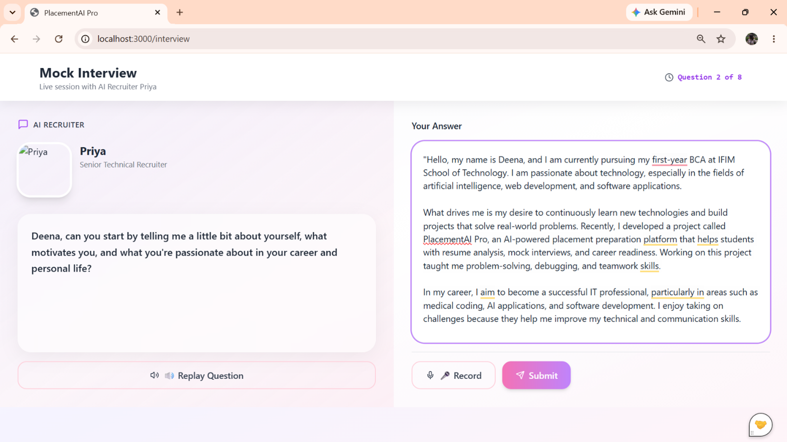
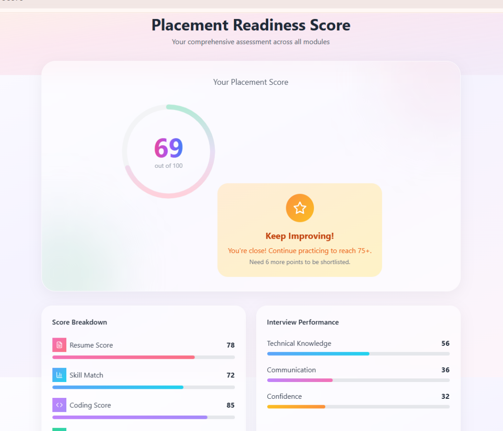

# PlacementAI Pro

An AI-powered Placement Preparation Platform that helps students become placement-ready through comprehensive tools and AI-driven analysis.
## Screenshots

### Dashboard


### Login


### Mock Interview


### Placement Readiness

## Features

### Core Features
- **AI Resume Analyzer** - Upload your resume and get instant AI-powered feedback on ATS compatibility, clarity, technical skills, impact, and structure
- **Skill Gap Detection** - Compare your skills against target job roles and identify areas for improvement
- **AI Mock Interview** - Practice with AI recruiter Priya through voice and text interaction
- **Coding Assessment** - Test your coding skills with real interview questions using Monaco editor
- **Learning Roadmap** - Follow a personalized learning path with progress tracking
- **Placement Score** - Comprehensive placement readiness score with detailed breakdown

### Technical Features
- Modern, responsive UI with glassmorphism design
- Beautiful pastel color scheme (pink, blue, lavender, mint)
- Smooth animations with Framer Motion
- Interactive charts with Recharts
- Monaco code editor for coding tests
- Voice interaction support for interviews
- Real-time AI feedback

## Tech Stack

- **Frontend**: Next.js 13, React 18, TypeScript
- **Styling**: Tailwind CSS, Framer Motion
- **UI Components**: Radix UI, shadcn/ui
- **Database**: Supabase (PostgreSQL)
- **Authentication**: Supabase Auth
- **Charts**: Recharts
- **Code Editor**: Monaco Editor
- **Icons**: Lucide React

## Getting Started

### Prerequisites
- Node.js 18+ 
- npm or yarn

### Installation

1. Clone the repository:
```bash
git clone <repository-url>
cd placementai-pro
```

2. Install dependencies:
```bash
npm install
```

3. Set up environment variables:
```bash
cp .env.example .env
```

4. Configure your `.env` file with:
```env
NEXT_PUBLIC_SUPABASE_URL=your_supabase_url
NEXT_PUBLIC_SUPABASE_ANON_KEY=your_supabase_anon_key
```

5. Run the development server:
```bash
npm run dev
```

6. Open [http://localhost:3000](http://localhost:3000) in your browser.

### Build for Production

```bash
npm run build
npm start
```

## Project Structure

```
placementai-pro/
├── app/
│   ├── page.tsx              # Landing page
│   ├── layout.tsx            # Root layout
│   ├── login/                # Authentication page
│   ├── dashboard/            # Main dashboard
│   ├── resume/               # Resume analyzer
│   ├── skill-analysis/       # Skill gap analysis
│   ├── roadmap/              # Learning roadmap
│   ├── coding-test/          # Coding assessment
│   ├── recruiter/            # AI recruiter chat
│   ├── interview/            # Mock interview
│   ├── feedback/             # Feedback dashboard
│   └── score/                # Placement score
├── components/
│   ├── ui/                   # shadcn/ui components
│   ├── floating-circles.tsx  # Animated background
│   ├── navbar.tsx            # Navigation bar
│   ├── score-card.tsx        # Score display cards
│   ├── pastel-button.tsx     # Custom button component
│   ├── progress-bar.tsx      # Progress components
│   └── loading-spinner.tsx   # Loading states
├── lib/
│   ├── supabase.ts           # Supabase client & types
│   ├── auth-context.tsx      # Authentication context
│   ├── types.ts              # TypeScript types
│   ├── constants.ts          # App constants
│   └── utils.ts              # Utility functions
└── public/                   # Static assets
```

## Pages Overview

### Landing Page (`/`)
- Hero section with animated background
- Feature showcase
- How it works section
- Testimonials
- Call to action

### Login/Register (`/login`)
- Email/password authentication
- Social login buttons
- Form validation
- Animated transitions

### Dashboard (`/dashboard`)
- Overall score summary
- Score breakdown cards
- Quick action buttons
- Activity timeline
- Upcoming milestones

### Resume Analyzer (`/resume`)
- Drag and drop file upload
- AI analysis with score breakdown
- Strengths, weaknesses, improvements
- Download report option

### Skill Gap Analysis (`/skill-analysis`)
- Job role selector
- Radar chart visualization
- Pie chart for match percentage
- Missing skills with priority

### Learning Roadmap (`/roadmap`)
- Progress overview
- Expandable milestone steps
- Resource links
- Completion tracking

### Coding Test (`/coding-test`)
- Monaco code editor
- Multi-language support
- Question navigation
- Timer and score

### AI Recruiter (`/recruiter`)
- Chat interface with Priya
- Quick prompt suggestions
- Typing animations
- Context-aware responses

### Mock Interview (`/interview`)
- Setup page with camera option
- AI recruiter panel with voice
- Candidate answer panel (text/voice)
- Real-time question progression
- Complete feedback summary

### Feedback Dashboard (`/feedback`)
- Score progress chart
- Category breakdown
- Recent feedback history
- Improvement tips

### Placement Score (`/score`)
- Large animated score display
- Score breakdown
- Radar chart
- Achievements/badges
- Shortlist status
- Notification options

## Design System

### Colors
- **Pink Soft**: `#FFD1DC`
- **Blue Soft**: `#D4E6F1`
- **Lavender Soft**: `#E8DFF5`
- **Mint**: `#B5EAD7`
- **Gray Text**: `#5A5A5A`

### Typography
- **Primary Font**: Inter
- **Display Font**: Poppins

### Animations
- Floating background circles
- Page transitions
- Hover effects
- Progress animations
- Speaking animations

## Database Schema

The application uses Supabase with the following tables:
- `users` - User profiles
- `resumes` - Resume uploads and scores
- `skills` - User skills
- `skill_analysis` - Skill gap analysis results
- `interviews` - Interview records
- `coding_assessments` - Coding test submissions
- `learning_milestones` - Roadmap milestones
- `placement_scores` - Overall placement scores

## Contributing

1. Fork the repository
2. Create your feature branch (`git checkout -b feature/amazing-feature`)
3. Commit your changes (`git commit -m 'Add amazing feature'`)
4. Push to the branch (`git push origin feature/amazing-feature`)
5. Open a Pull Request

## License

This project is licensed under the MIT License.

## Acknowledgments

- Design inspiration from modern SaaS platforms
- Icons by Lucide
- UI components by shadcn/ui
- Charts by Recharts
